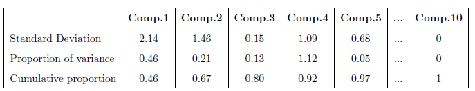
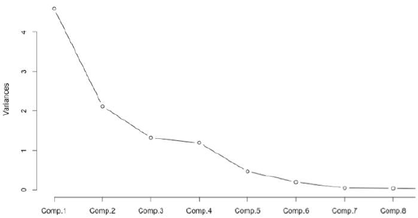
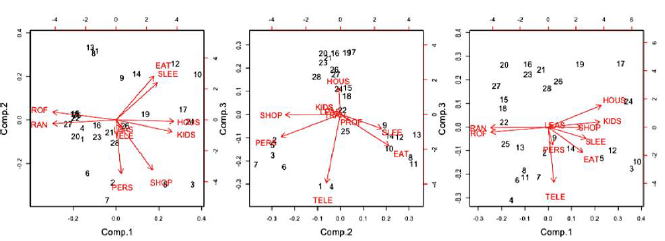
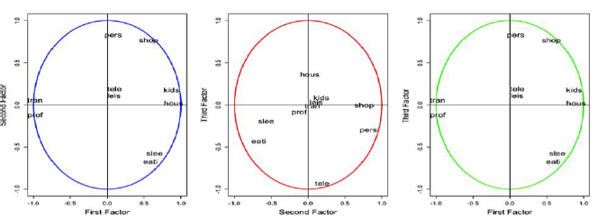
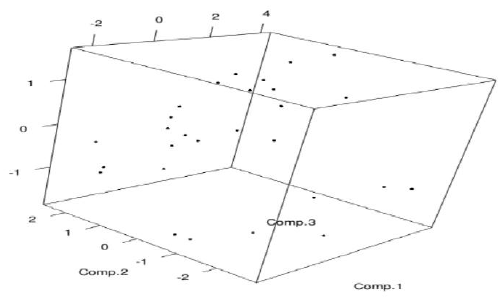

[](http://quantlet.de/index.php?p=info)

## [](http://quantlet.de/)  **FAMPCA** [](http://quantlet.de/d3/ia)

```yaml

Name of QuantLet : FAMPCA

Published in :  Factor Analysis and Multivariate Regression

Description : 'Shows how many components are reasonable and sufficient to use'

Keywords : 
- dimension-reduction
- standard deviation
- graphical represtation
- factor analysis
- plot

Author : Daria Fitisova, Maria Kozlova, Yihan Liu, Andrea Mina Weihe

Submitted : Sat, Aug 13 2016 by Yihan Liu

```






).png)


```r

#  principal component analysis
pca . time=princomp ( time , s c o r e s=T, cor=T)
summary( pca . time )

#  visualize the rule
plot ( pca . time , type=" l " )

#  visualize the vectors of initial variables
bip1=b i p l o t ( pca . time , c h o i c e s =1:2)

#  generate interactive plot
l ibrary ( r g l )
plot3d ( pca . time$ s c o r e s [, 1 : 3 ] )
l ibrary ( pca3d )
pca3d ( pca . time , components = 1 : 3 )
