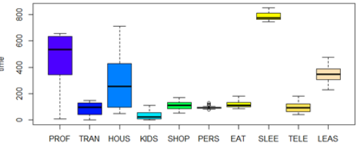
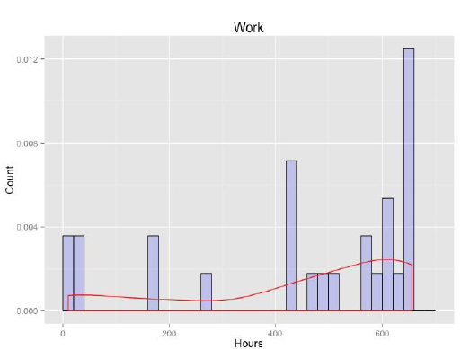
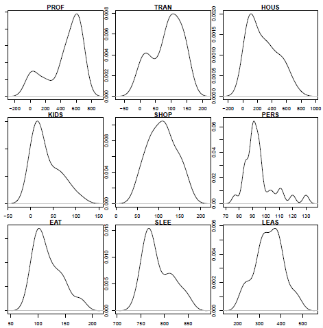

[](http://quantlet.de/index.php?p=info)

## [](http://quantlet.de/) **FAMdataanalysis** [](http://quantlet.de/d3/ia)

```yaml

Name of QuantLet:  FAMdataanalysis

Published in:      Factor Analysis and Multivariate Regression

Description:       Constructs histograms of our variables with the help of the `ggplot2 `package

Keywords:          histogram, distribution, boxplot, graphical represtation, visualization, plot

Author:            Daria Fitisova, Maria Kozlova, Yihan Liu, Andrea Mina Weihe

Submitted:         Sat, Aug 13 2016 by Yihan Liu

```




 

```r

# visualize the finding
boxplot ( timebudge , col = topo . colors ( 1 0 ) , ylab=" time " )

# construct histogram using `ggplot2 `package
pdf ( f i l e = "histPROF . pdf " )
par (mfrow=c ( 1 , 1 ) )
ggpl ot (data=Timebudget , ae s (Timebudget$PROF) ) +
geom hi s togram ( ae s ( y =. . density . . ) ,
br eaks=seq ( 0 , 700 , by = 20) ,
col=" black " ,
f i l l=" blue " ,
alpha = . 2 ) +
geom density ( col=2) +
l abs ( t i t l e=" Pr o f e s s i o n a l Ac t i v i t y " ) +
l abs ( x="Hours" , y="Count" )
dev . of f ( )
Figure

# employ kernel density estimates as separate plots
par (mfrow=c ( 3 , 3 ) ,mar=c ( 2 , 1 , 1 , 1 ) )
d f p l o t = function (data . frame ) f
df = data . frame
ln = length (names(data . frame ) )
for ( i in 1 : ln )f
plot ( density ( df [ , i ] , main=names( df ) [ i ] ) ,
main= colnames ( df ) [ i ] )
}
}
d f p l o t (Timebudget )


